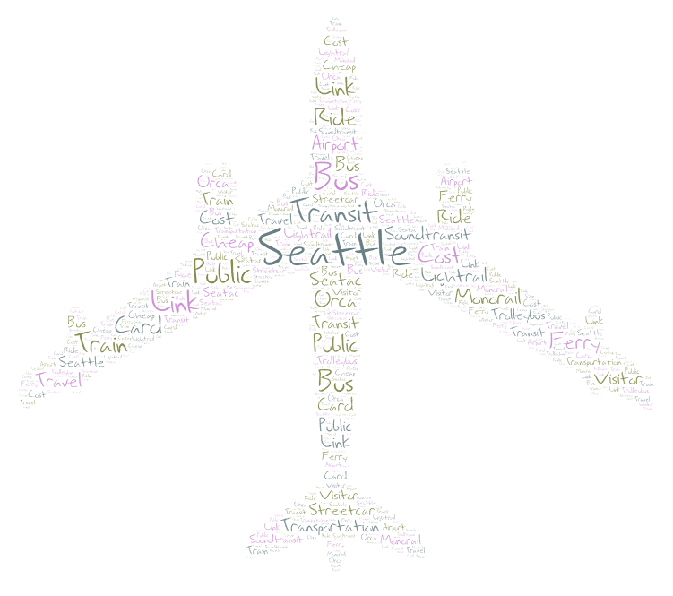
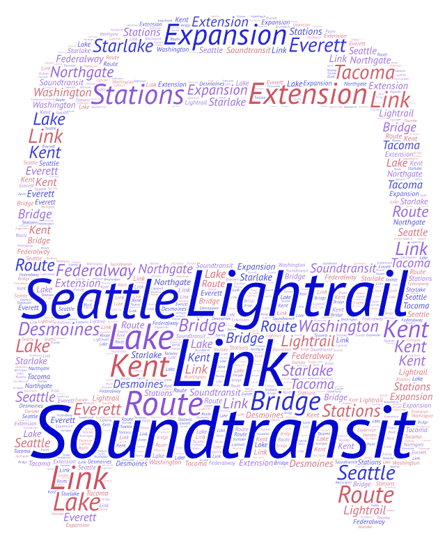
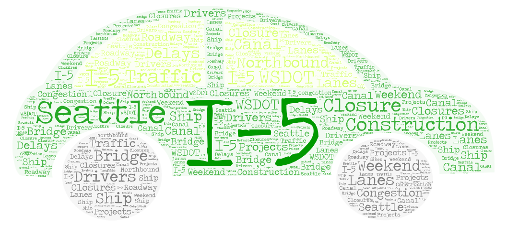

# GEOG458 Lab 2: Web data collection and visualization - Anthony Tran

## Topic and Search Parameters
**Topic:** Seattle Public Transit  
**Search Keywords Used:**
1. Seattle public transit  
2. Sound Transit light rail  
3. I-5 traffic Seattle

**Number of Results Collected:**
- Search 1: [14 rows]* 
- Search 2: [17 rows]  
- Search 3: [16 rows]

## Reasoning for Choice of Search Terms
> I chose these terms to compare how public transit is discussed across different transportation topics in Seattle.  
> 'Seattle public transit' as a general compass, while 'Sound Transit light rail' is more focused, and 'I-5 traffic Seattle' shows traffic-related niche.

##  Word Clouds
### Word Cloud 1 — Seattle public transit

### Word Cloud 2 — Sound Transit light rail

### Word Cloud 3 — I-5 traffic Seattle

## Comparisons
**Similarities:**
- Bridge appears in both image 2 and 3

**Differences**
- image 1 has "Train", "Travel", and "Streetcar" while image 2 has "Lightrail", "Route", and varying cities like "Kent", "Seattle", and "Tacoma"

**Why these patterns exist?**
- Varying search terms may differ from what viewers expect when searching for these videos.
- Seattle public transit is a more generic grouping for transportation in comparison to the other two which are more niche

**Improvements?**
- Using more search terms to broaden comparison
- Collecting more videos per keyword for stronger analysis. (Considering all 3 had less than 20 rows after the bot finished)

**Surprising Findings**
- Seattle public transit had less rows then the other two search terms which are considerably more niche.
- Some of the key terms in the other word clouds had terms that should've been shared or fit with others like "Train" in Seattle public transit, but wasn't in Sound Transit light rail 

## Data Download Links
Download the CSV files here:
- [Search Result 1](data/SeattlePublicTransit.csv)
- [Search Result 2](data/SoundTransitLR.csv)
- [Search Result 3](data/I-5_Traffic_Seattle.csv)
